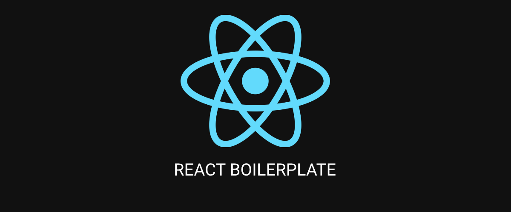

<style>
  #teste {
    background: linear-gradient(270deg, red, yellow, lime, cyan, magenta);
    background-size: 400% 400%;
    -webkit-animation: AnimationName 5s ease infinite;
    -webkit-background-clip: text;
    -webkit-text-fill-color: transparent;
  }
  @-webkit-keyframes AnimationName {
    0%{background-position:0% 50%}
    50%{background-position:100% 50%}
    100%{background-position:0% 50%}
  }
</style>

<h1 align="center">
  
</h1>

<p align="center">
  
  
  
</p>

<h1 id="teste" align="center">
    React Boilerplate
</h1>
<p align="center">Meu boilerplate pessoal para criação de aplicações React.</p>

<p align="center">
 <a href="#-sobre-o-projeto">Sobre o Projeto</a> •
 <a href="#-tecnologias">Tecnologias</a> •
 <a href="#-configurações-necessárias">Configurações necessárias</a> •
 <a href="#-licença">Licença</a>
</p>

## 📌 Sobre o projeto

Exemplo de descrição.

---

## 💻 Tecnologias

- [ReactJS](https://reactjs.org/)
- [Typescript](https://www.typescriptlang.org/)
- [Vite](https://vitejs.dev/)

---

## 🚧 Configurando o ambiente de desenvolvimento

### **Requisitos**

> Será <span style="border-bottom: solid 1px #f66;">necessário</span> instalar os items abaixo para clonar e executar o projeto corretamente!

- [Git](https://git-scm.com)
- [Node](https://nodejs.org)

### **Clonando e executando a aplicação**

```bash
# Primeiro clone o repositório utilizando git:
$ git clone https://github.com/KernelDN/react-boilerplate.git

# Depois acesse a pasta do projeto:
$ cd react-boilerplate

# Em seguida instale as dependências:
$ npm i

# Por fim, inicie a aplicação:
$ npm run dev
```

---

## 📜 Licença

Distribuído sob a licença MIT. Veja [LICENSE](LICENSE) para mais informações.

---

Feito com ❤️ por Deigo Natalo!
